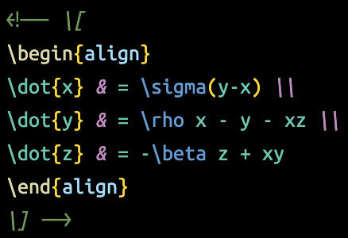

# LaTeX and Markdown Injection

Accompanies the @samplekit/preprocess-katex npm package to make typesetting math pleasant inside Svelte.

## Features

- injects LaTeX highlighting into HTML comments inside Svelte markup.
- injects LaTeX highlighting into tagged template literals in JS.
- adds snippets to make it quicker to generate the required HTML comments.

## Svelte HTML Comments

By using HTML comments, it's trivial to write a preprocessor without running afoul of svelte check, prettier, eslint, typescript, etc.

#### `<!-- \[ \] -->` (KaTeX display mode) and `<!-- \( \) -->` (KaTeX inline mode)

Before

After

## JS/TS Template Literals

A tagged template literal is used to inject KaTeX highlighting into JS.

#### <code>katex\`</code> or <code>latex\`</code> (case insensitive)

Before

After

## Extension

> [VSCode Marketplace](https://marketplace.visualstudio.com/items?itemName=timothycohen.svelte-katex)
