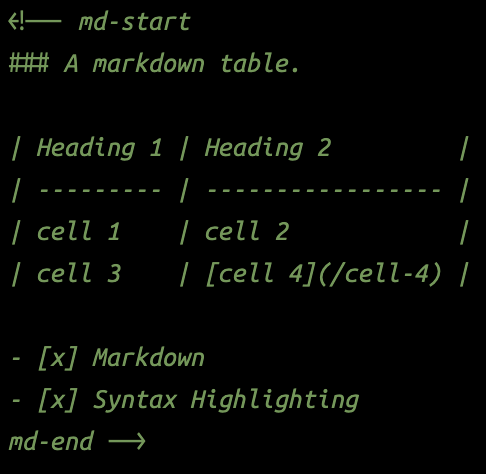
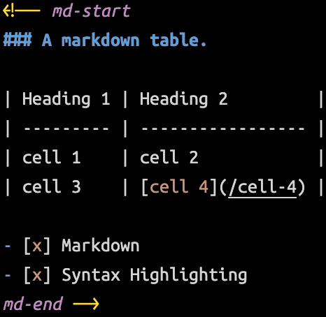

# LaTeX and Markdown Injection

Accompanies the @samplekit/preprocess-markdown npm package to make Markdown pleasant to use inside Svelte.

## Features

- injects Markdown highlighting into HTML comments inside Svelte markup.
- adds snippets to make it quicker to generate the required HTML comments.

## Svelte HTML Comments

By using HTML comments, it's trivial to write a preprocessor without running afoul of svelte check, prettier, eslint, typescript, etc.

#### `<!--md-start md-end-->`

Before

After

## Extension

> [VSCode Marketplace](https://marketplace.visualstudio.com/items?itemName=timothycohen.svelte-markdown)
